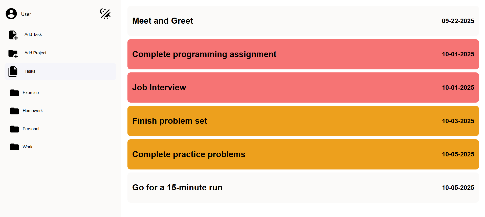
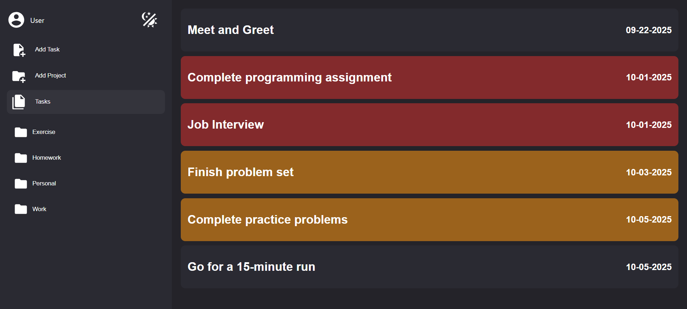
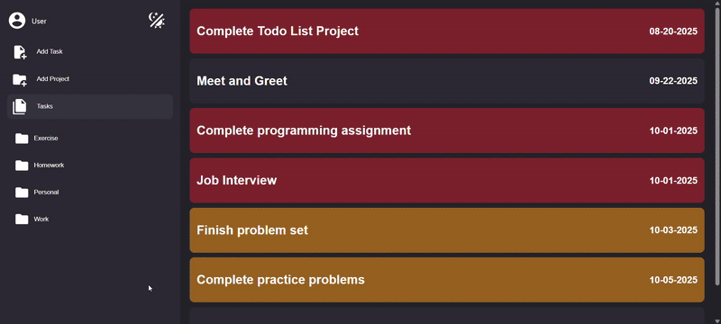
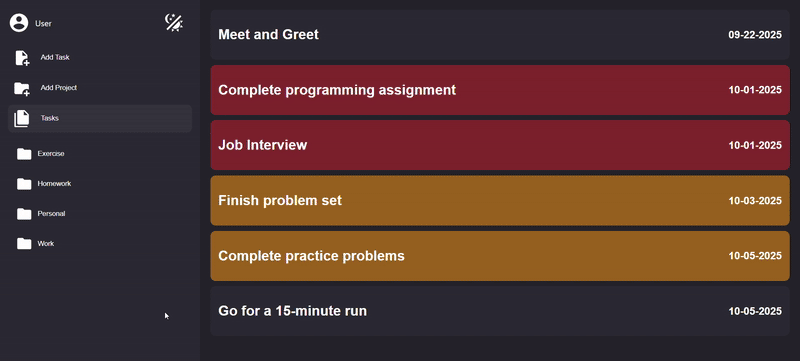

# to-do-list

The to-do-list project involves the creation of a productivity application for users to create and keep track of tasks to complete and organize tasks to be completed within projects.

The main learning objective of the project was code organization through modules and object-oriented programming principles. The large scope of the project provided the opportunity to practice with the object creation and organization patterns from previous lessons for modules with low coupling and high cohesion and incorporate the SOLID principles and the principle of composition over inheritance within class design.

The other learning objective was the use of the Web Storage API to store data for the tasks to be completed and projects in ```localStorage```. The use of the Web Storage API presented the opportunity to learn about persistence which ensures data remains available after the application has been closed and accessible when the application is loaded again. Because persistence is closely related to relational databases, the data storage within ```localStorage``` was designed with the structure of relational databases in mind. The key-value pairs for the attributes of JSON objects are analogous to the rows and columns of a table in a relational databas and there are two separate objects for tasks and projects. In a similar fashion to the use of primary and foreign keys within a relational database, the unique id of a project establishes a one-to-many relationship between the project and the tasks which belong to the project because the tasks belonging to a project contains the unique id of the project to which the task belongs to.

An additional feature of the application is light mode and dark mode. The theme defaults to the preferences of the operating system and users have the option to override the default theme. The application stores the theme which was last used when the user closes the application and uses that theme when the user opens the application again.

## Light and Dark Mode





<video controls aria-label="Video demonstration of switching between light mode and dark mode." src="https://github.com/user-attachments/assets/6f08d8d0-9487-4931-a74f-cb6aaa35453e" title="Switching Between Light Mode and Dark Mode"></video>

## Viewing Tasks Within Projects


## Creating Tasks


## Editing and Deleting Tasks



## Creating Projects



## Editing and Deleting Projects

